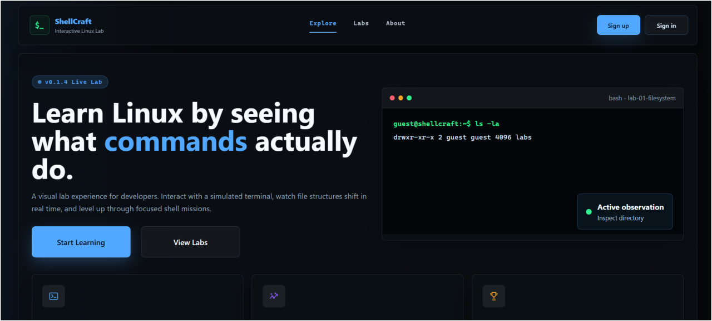
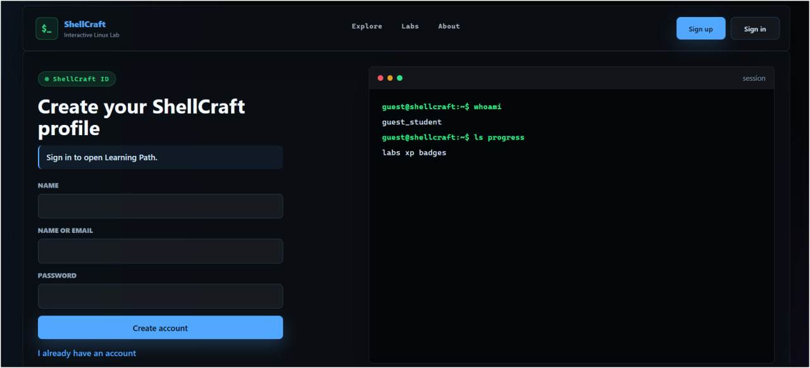
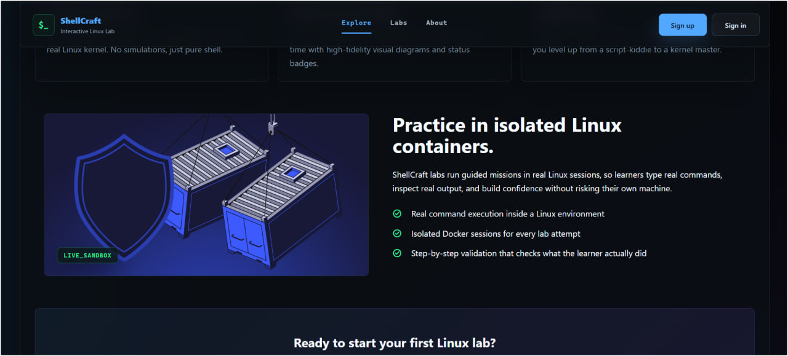

# ShellCraft

ShellCraft is an interactive Linux learning lab. It helps beginners practice shell commands through guided missions, visual feedback, XP, badges, and a terminal-style interface.

The project is designed for a clean run: reviewers can start the UI with Docker Compose or run the Angular frontend locally.

## Project Idea

Learning Linux from static notes is hard because beginners do not always see what a command changed. ShellCraft turns command-line practice into short missions:

- explore filesystem and permission tasks step by step
- type commands in a terminal-style lab screen
- see visual explanations of command effects
- follow a roadmap of labs with XP and badge rewards
- practice safely without risking the learner's own machine

The latest UI includes guest exploration pages, real account sign in/sign up, server-side progress and settings, a lab roadmap, and completed-lab reward screens. Guests can still explore with progress saved locally in the browser; signing in persists XP, progress, and settings in the backend.

## Tech Stack

- Frontend: Angular 21, TypeScript, SCSS
- Frontend state: Angular Signals
- Backend: FastAPI, Uvicorn
- Persistence: Postgres (async SQLAlchemy + Alembic) for users, XP, progress, and settings
- Sessions: Redis-backed server-side sessions with httpOnly cookies
- Sandbox: Docker-based Linux lab image for real command sessions
- Packaging: Docker Compose
- Tests: Angular/Vitest frontend tests, pytest backend tests
- CI: GitHub Actions

## Screenshots

### Explore Page



### Authentication Page



### Real Linux Containers Section



## Quick Start With Docker

Requirements:

- Git
- Docker Desktop or Docker Engine with Docker Compose

Start the frontend clean-run stack:

```bash
git clone https://github.com/alarinne/shellcraft.git
cd shellcraft
docker compose --profile full up --build
```

Open:

```text
http://localhost:4200
```

Stop the stack:

```bash
docker compose down
```

## Full Stack With Backend And Sandbox

The full profile starts the frontend, FastAPI backend, Postgres, Redis, and the sandbox image used for real Linux lab sessions. The backend applies database migrations automatically on startup. In this mode the GUI is fully wired: the frontend nginx reverse-proxies `/api` (REST + the sandbox WebSocket) to the backend, so sign in/up, XP, progress, settings, and the real Linux terminal all work through `http://localhost:4200`.

A plain `docker compose up` (no profile) still serves the frontend on its own; sign in and the real sandbox require the full profile, while guests can explore with progress saved in the browser.

```bash
docker compose --profile full up --build
```

Open:

```text
Frontend: http://localhost:4200
Backend API: http://localhost:8000
Backend docs: http://localhost:8000/docs
```

Notes:

- Docker must be running before starting the full profile.
- Postgres stores users, XP, progress, and settings; Redis stores sessions. Data persists in `./.docker/postgres` and `./.docker/redis` (created on first run, gitignored).
- Real Linux lab sessions require access to the Docker socket from the backend container.
- On Docker Desktop, use Linux containers mode.

## Local Frontend Development

Requirements:

- Node.js 22+
- npm

Run:

```bash
cd frontend
npm install
npm start
```

Open:

```text
http://localhost:4200
```

## Local Backend Development

Requirements:

- Python 3.12+
- Postgres and Redis (easiest via `docker compose --profile full up postgres redis`)
- Docker, only if sandbox mode is enabled

Run:

```bash
cd backend
python -m venv .venv
.venv\Scripts\activate
pip install -r requirements.txt
copy .env.example .env
alembic upgrade head
uvicorn app.main:app --reload
```

Open:

```text
http://localhost:8000/docs
```

For macOS/Linux, activate the virtual environment with:

```bash
source .venv/bin/activate
```

## Build And Test

Frontend:

```bash
cd frontend
npm run build
npm test -- --watch=false
```

Backend:

```bash
cd backend
pip install -r requirements-dev.txt
pytest -q
```

## Project Structure

```text
shellcraft/
  frontend/        Angular application and UI
  backend/         FastAPI backend and sandbox integration
  docs/            API contracts, ADRs, and feature notes
  screenshots/     README screenshots
  docker-compose.yml
  README.md
```

## Current MVP

- Explore page with ShellCraft overview and real Linux containers section
- Guest roadmap for the lab path with local (browser) progress
- Real account sign in/sign up backed by the API (httpOnly session cookie)
- Server-side progress, XP, and levels for signed-in users
- Settings page (theme, terminal font size, sound, reduced motion) saved per account
- Lab screen with terminal workflow and visual command feedback
- Completed screen with reward/badge presentation
- Docker clean-run setup for reviewers

