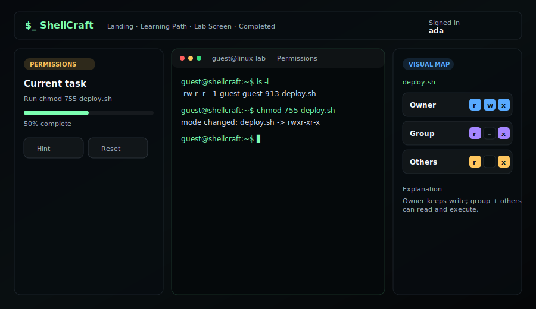
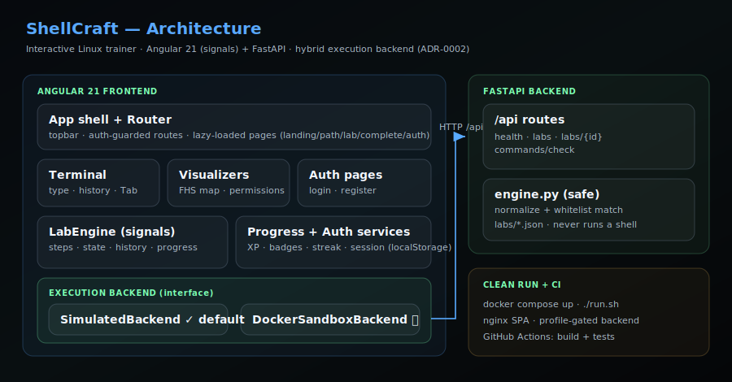

# ShellCraft

> Interactive, visual trainer for learning Linux — a gamified terminal lab, not dry man pages.

ShellCraft turns Linux practice into short, hands-on labs: type commands into a
safe simulated terminal, **watch** the filesystem and permission model change in
real time, and level up through XP, badges, and streaks.



## Why it exists

Built for the **"Linux Gamified & Visualized"** hackathon. It targets every
judging axis: a polished dark UI, real interactivity/gamification, clean modular
architecture (the "Linux-way"), and a complete, runnable MVP — plus the
mandatory clean-run, CI, and documented setup.

## Features

| Area | What you get |
| --- | --- |
| **Interactive terminal** | Type-to-run, command history (↑/↓), Tab autocomplete, colored scrollback |
| **Visualization** | Live FHS map (breadcrumb + entries) and an `rwx` permission grid that reacts to `chmod`/`cd` |
| **Gamification** | XP, badges, and a daily streak persisted across sessions; labs unlock as you progress |
| **Accounts** | Register / sign in; progress is saved per user; protected routes via a guard |
| **Data-driven labs** | Labs are JSON/TS data, not hard-coded — easy to author more |
| **Safe by design** | The simulator never runs a real shell; an opt-in hardened Docker sandbox is the only place real commands run (ADR-0002) |

## Tech stack

- **Frontend:** Angular 21 (standalone components + **signals**, modern control flow), SCSS dark theme
- **Backend:** FastAPI (lab content as JSON, deterministic command checking)
- **Tests:** Vitest (frontend) · pytest + httpx (backend)
- **Run / CI:** Docker Compose + nginx · `run.sh` · GitHub Actions

## Quick start

### Option A — Docker (clean run)

```bash
docker compose up --build          # → http://localhost:4200
# full stack (frontend + FastAPI backend):
docker compose --profile full up --build
```

### Option B — one script

```bash
./run.sh           # Docker if available, otherwise a local npm dev server
```

### Option C — local dev

```bash
cd frontend
npm install
npm start                          # → http://localhost:4200
```

Backend (optional):

```bash
cd backend
python -m venv .venv && source .venv/bin/activate
pip install -r requirements.txt
uvicorn app.main:app --reload      # → http://localhost:8000  (docs at /docs)
```

## Build & test

```bash
# frontend
cd frontend && npm run build && npx ng test --watch=false
# backend
cd backend && pip install pytest httpx && pytest -q
```

CI runs all of the above on every PR (`.github/workflows/ci.yml`).

## Architecture



The frontend is a thin **App shell** (topbar + router) over lazy-loaded page
components. A `LabEngine` service (signals) drives lab steps and delegates
command evaluation to a pluggable **`ExecutionBackend`**:

- **`SimulatedBackend`** (default) — deterministic, safe, gradable, zero-infra.
- **`DockerSandboxBackend`** (opt-in, planned) — real commands inside a hardened
  ephemeral container for free exploration.

See [`docs/adr/ADR-0002`](docs/adr/ADR-0002-hybrid-execution-backend.md) and the
per-feature docs in [`docs/features/`](docs/features). Project conventions live
in [`CLAUDE.md`](CLAUDE.md); contribution workflow in
[`CONTRIBUTING.md`](CONTRIBUTING.md).

## Project structure

```text
shellcraft/
  frontend/            Angular 21 app
    src/app/
      pages/           routed screens (landing, path, lab, complete, auth)
      components/      terminal, visualizers
      core/            execution engine, labs, progress, auth
  backend/             FastAPI service (labs JSON + safe command checking)
  docs/                ADRs, feature docs, API contract, lab schema
  screenshots/         README media
  docker-compose.yml   clean-run stack
  run.sh               one-command bootstrap
```

## Safety model

ShellCraft is a learning simulator. User-entered commands are **never** executed
on the host in the default path — they are parsed and matched against lab data.
Real execution only ever happens inside the hardened, network-isolated Docker
sandbox described in ADR-0002.

## Screenshots

`screenshots/` ships SVG visuals of the interface and architecture. To capture a
live PNG/GIF of your running instance, start the app (`./run.sh`) and record the
Lab screen at `http://localhost:4200`.

## Roadmap

Tracked as GitHub issues. Remaining highlights:

- Hardened ephemeral **Docker sandbox** execution backend (#9)
- **Process & signals** visualizer — SIGTERM vs SIGKILL (#13)
- **Pipes & grep** stream visualizer for Lab 03 (#14)
