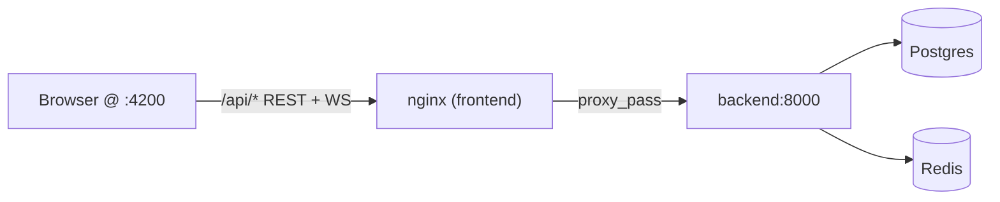

# Feature: Frontend ↔ Backend Integration (cookie auth, server progress, settings)

- **Issue:** #<n>
- **PR:** #<n>
- **Status:** Shipped
- **Area:** frontend | infra

## Why

Feature #30 added the persistence backend (Postgres + Redis, real auth, progress,
settings), but the Angular GUI still used `localStorage` mocks, so signing in,
XP, and progress never touched the database. This change wires the frontend to
the backend and makes `docker compose --profile full up --build` serve a fully
working app at `http://localhost:4200` — including the real Linux sandbox — so
the persistence and gamification work end to end through the browser.

Confirmed scope: signed-in users go through the backend; guests keep working via
`localStorage`; a settings page is added.

## What changed

- **HTTP foundation** — `core/api/http.ts` adds `apiFetch()`: a `fetch` wrapper
  that always sends the session cookie (`credentials: 'include'`), JSON-encodes
  bodies, and normalizes FastAPI errors (`{ detail }` / 422 arrays) into a
  friendly `{ ok, status, data, error }`. `API_BASE` stays `''` so calls are
  same-origin through the dev proxy and the new nginx proxy.
- **Session restore** — `app.config.ts` uses `provideAppInitializer` to call
  `AuthService.restoreSession()` (`GET /api/auth/me`) before the first route
  activates, so guards see the correct auth state on reload.
- **Auth** — `AuthService` is now async and cookie-based: `register`/`login`/
  `logout` hit `/api/auth/*`, and `AuthUser` carries `xp`/`level`. The
  `localStorage` user store and client-side password digest are gone (the
  backend is the source of truth). `auth.page.ts` and `app.ts` await these calls
  and surface backend error messages.
- **Progress** — `LabProgress` loads `GET /api/progress` for signed-in users via
  an `effect` on the current user and persists completions with
  `POST /api/progress/{labId}/complete` (then refreshes XP via `restoreSession`).
  Guests keep the `localStorage` behavior unchanged.
- **Settings (new)** — `core/settings/settings.service.ts` loads/saves
  `GET`/`PUT /api/settings` and applies preferences to `document.documentElement`
  (`data-theme`, `--sc-terminal-font-size`, `data-reduced-motion`). A new routed
  `pages/settings` component (guarded by `authGuard`) exposes theme, terminal
  font size, sound, and reduced-motion controls, with a "Settings" link in the
  member nav. A light theme and reduced-motion rules were added to `styles.scss`.
- **nginx proxy** — `frontend/nginx.conf` reverse-proxies `/api/` to
  `backend:8000` with WebSocket upgrade support, using Docker's embedded DNS
  resolver + a variable upstream so nginx still starts on a plain
  `docker compose up` (no `full` profile / no backend present).

## How it works



All REST calls are same-origin and relative (`/api/...`), so the httpOnly
session cookie set by the backend flows back transparently through nginx (dev:
the Angular proxy). The sandbox PTY WebSocket connects directly to the published
backend `:8000` (no auth cookie needed), so no client change was required there.

For guests, `LabProgress` reads/writes the `'guest'` key in `localStorage`; for
members it mirrors backend progress in a signal hydrated from `/api/progress`.

## Testing

A `fetch` mock helper (`core/testing/api-mock.ts`) stubs the backend with a
`"METHOD /path"` route table and a `settle()` helper that flushes Angular effects
plus pending mock promises. Specs updated/added:

- `auth.service.spec.ts` — register, duplicate-email (409), invalid login (401),
  session restore, guest on 401.
- `auth.page.spec.ts` — async register → navigate, backend error surfacing.
- `auth.guard.spec.ts` — authenticated via restored session.
- `lab-progress.spec.ts` — guest localStorage path + member backend load/persist.
- `path.page.spec.ts` — progress-driven roadmap for a signed-in member.
- `settings.service.spec.ts`, `settings.page.spec.ts` — load/apply/persist.
- `app.spec.ts` — routing with a restored session.

Gate (both green):

```bash
cd frontend
npm run build
npx ng test --watch=false   # 60 passed
```

## Follow-ups

- Add a backend progress-reset endpoint (today `resetLab` is local-only for
  members).
- Optional: route the sandbox WebSocket through nginx as well for single-port
  deployments.
